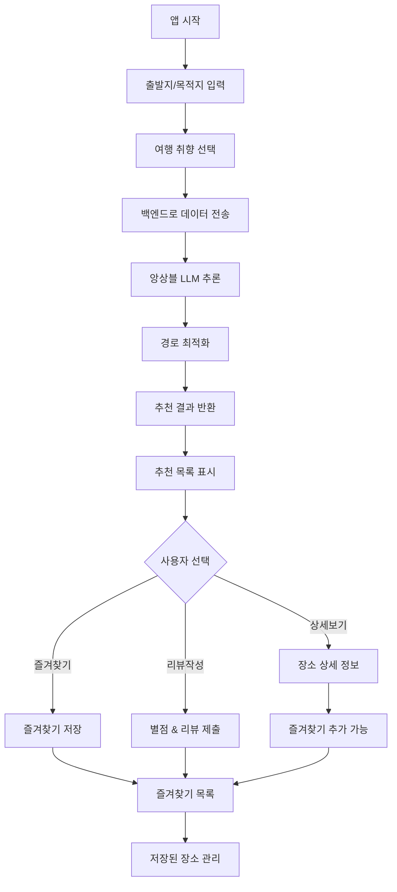

# PathApp Frontend

> **대구가톨릭대학교(DCU) 캡스톤 디자인 프로젝트**  
> 앙상블 LLM 기반 경로 최적화 관광지 추천 모바일 애플리케이션

---

## 📖 프로젝트 개요

PathApp은 **두 개의 LLM을 앙상블 방식으로 활용**하여 사용자 맞춤형 관광지를 추천하는 모바일 애플리케이션입니다. 출발지와 목적지를 설정하면, 경로 상에 있는 최적의 여행지를 AI가 분석하여 제안합니다.

본 저장소는 **모바일 프론트엔드**를 담당하며, AI 추론 엔진과 데이터 처리는 별도의 백엔드 서버에서 운영됩니다.

---

## 🏗️ 시스템 아키텍처

```
┌───────────────────────────────────────────────────────────────┐
│                           사용자                                │
│                            ↓↑                                 │
├───────────────────────────────────────────────────────────────┤
│                      Mobile Frontend                          │
│                     (React Native + Expo)                     │
│   ┌───────────────────────────────────────────────────────┐   │
│   │  • 출발지/목적지 입력                                      │   │
│   │  • 선호도 설정                                           │   │
│   │  • 추천 결과 표시                                         │   │
│   │  • 즐겨찾기 & 리뷰 관리                                    │   │
│   └───────────────────────────────────────────────────────┘   │
│                            ↓↑                                 │
│                         REST API                              │
│                            ↓↑                                 │
├───────────────────────────────────────────────────────────────┤
│                       Backend Server                          │
│                    (API Server + Database)                    │
│   ┌───────────────────────────────────────────────────────┐   │
│   │  • 사용자 인증 & 데이터 관리                                │   │
│   │  • 즐겨찾기/리뷰 CRUD                                     │   │
│   │  • 위치 데이터 처리                                       │   │
│   └───────────────────────────────────────────────────────┘   │
│                            ↓↑                                 │
├───────────────────────────────────────────────────────────────┤
│                    Ensemble LLM Engine                        │
│   ┌───────────────────────────────────────────────────────┐   │
│   │          LLM Model 1          LLM Model 2             │   │
│   │               ↓                    ↓                  │   │
│   │               └────────┬───────────┘                  │   │
│   │                   Ensemble Logic                      │   │
│   │                        ↓                              │   │
│   │               경로 최적화 알고리즘                         │   │
│   │                        ↓                              │   │
│   │             맞춤형 관광지 추천 결과                         │   │
│   └───────────────────────────────────────────────────────┘   │
└───────────────────────────────────────────────────────────────┘
```

---

## 🔄 사용자 플로우



---

## ✨ 주요 기능

### 🤖 AI 기반 추천
- **앙상블 LLM**: 두 개의 독립적인 언어 모델을 결합하여 더 정확하고 다양한 추천 제공
- **경로 기반 추천**: 출발지에서 목적지까지 이동 경로를 고려한 관광지 제안
- **개인화**: 사용자의 취향과 선호도를 반영한 맞춤형 추천

### 📍 위치 및 경로
- **출발지/목적지 설정**: 현재 위치 또는 원하는 지점 지정
- **경로 최적화**: 이동 경로 상의 접근 가능한 관광지만 추천
- **상세 정보**: 각 여행지의 설명, 위치, 추천 이유 제공

### ⭐ 사용자 기능
- **즐겨찾기**: 마음에 드는 장소를 저장하고 모아보기
- **별점 평가**: 방문한 장소에 5점 만점 평점 부여
- **리뷰 작성**: 개인적인 방문 후기 기록
- **필터링**: 즐겨찾기한 장소만 선별하여 확인

---

## 🛠 기술 스택

- **React Native + Expo** - 크로스 플랫폼 모바일 앱 개발
- **TypeScript** - 타입 안전성을 갖춘 개발
- **Expo Router** - 파일 기반 네비게이션

### 지원 플랫폼
- iOS
- Android

---

## 🚀 실행 방법

```bash
# 저장소 클론
git clone https://github.com/ChocoDong/Capstone-pathApp-FE.git
cd Capstone-pathApp-FE

# 의존성 설치
npm install

# 개발 서버 시작
npx expo start
```

**실행 옵션**
- Android 에뮬레이터: `a` 키
- iOS 시뮬레이터: `i` 키 (macOS 필요)
- 실제 기기: Expo Go 앱으로 QR 코드 스캔

---

## 🎯 데이터 플로우

```
1. [프론트엔드] 출발지와 목적지 입력
   ↓
2. [프론트엔드] 여행 취향 및 선호도 선택
   ↓
3. [프론트엔드 → 백엔드] API 요청 전송
   ↓
4. [백엔드] 데이터 검증 및 전처리
   ↓
5. [백엔드 → LLM Engine] 추천 요청
   ↓
6. [LLM Engine] 앙상블 LLM 추론 실행
   ↓
7. [LLM Engine] 경로 최적화 알고리즘 적용
   ↓
8. [LLM Engine → 백엔드] 추천 결과 반환
   ↓
9. [백엔드 → 프론트엔드] 정제된 추천 목록 전송
   ↓
10. [프론트엔드] 추천 여행지 목록 표시
    ↓
11. [프론트엔드] 사용자 상호작용 (즐겨찾기, 리뷰)
    ↓
12. [프론트엔드 → 백엔드] 사용자 데이터 저장
```

---

## 🖼️ 주요 화면

### 메인 화면
- 출발지/목적지 입력
- 여행 선호도 설정
- 추천 시작

### 추천 결과 화면
- AI가 제안한 여행지 목록
- 각 장소의 미리보기 정보
- 상세 정보로 이동

### 상세 정보 화면
- 여행지 사진 및 설명
- 위치 정보
- 즐겨찾기 버튼
- 별점 및 리뷰 작성

### 즐겨찾기 화면
- 저장한 장소 목록
- 별점순/최신순 정렬
- 즐겨찾기 관리

---

## 🏆 수상 내역

**학술대회 논문 수상** 🎓
- 앙상블 LLM 기반 여행 추천 시스템의 혁신성 인정
- 사용자 중심 인터페이스 설계 우수성 평가

📄 **논문 상세 내용**: [학술대회 논문 보기](https://www.notion.so/2025-2f6d0f73735280f6acfee72056c42735)

---

## 💡 기술적 특징

### 프론트엔드 아키텍처
- React Hooks 기반 상태 관리
- RESTful API 통신
- 로컬 데이터 캐싱
- 반응형 UI 디자인

### 성능 최적화
- 이미지 지연 로딩
- 목록 가상화
- 효율적인 리렌더링

### 사용자 경험
- 직관적인 네비게이션
- 부드러운 애니메이션
- 접근성 고려 설계

---

## 🤝 프로젝트 정보

**대학**: 대구가톨릭대학교(DCU)  
**프로젝트 유형**: 캡스톤 디자인  
**개발자**: ChocoDong  
**프론트엔드 저장소**: [GitHub](https://github.com/ChocoDong/Capstone-pathApp-FE)

---

## 🔗 관련 저장소

- **백엔드 저장소**: [Capstone-pathApp-BE](https://github.com/ChocoDong/Capstone-pathApp-BE)  
  *(앙상블 LLM 추론 엔진, API 서버, 데이터베이스)*

---
